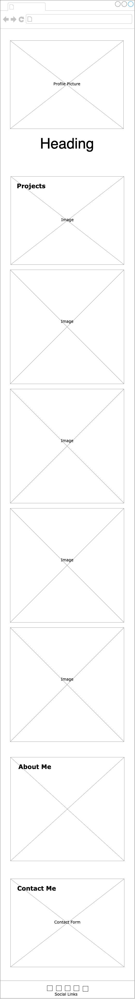

# Module 2 Assignment

## Tables of Content

- [The Assignment Brief](#the-assignment-brief)
- [Links](#links)
- [Screenshots](#screenshots)
- [Wireframes](#wireframes)
- [My Process](#my-process)
- [Acknowledgments](#acknowledgments)

## The Assignment Brief

Create a portfolio web app that showcases my skills and talents to employers. The web app should highlight my strongest work, as well as the technologies used to build it.

---

## Links

[Github Repository](https://github.com/matthew-millard/module-02-assignment)

[Github pages Links](https://matthew-millard.github.io/module-02-assignment/)

---

## Screenshots

- 

- 

- 

- 

---

## Wireframes

- 

- 

## My Process

1. Create a wireframe for both the mobile and desktop viewports.

2. Created a color palette on 

3. Mobile first approach.

4. Built the header and footer first. I used a `.page-container` technique to keep the footer fix to the bottom of the page.

5. I applied `display: flex;` to `.page-container` so I could also use it as the parent element to center all of my sections in the page.

6. Built out each feature of the page.

7. Used media queries so I could make the web app responsive to all screen sizes.

---

## Acknowledgments

CSS Reset
[Andy Bell](https://andy-bell.co.uk/a-modern-css-reset/)